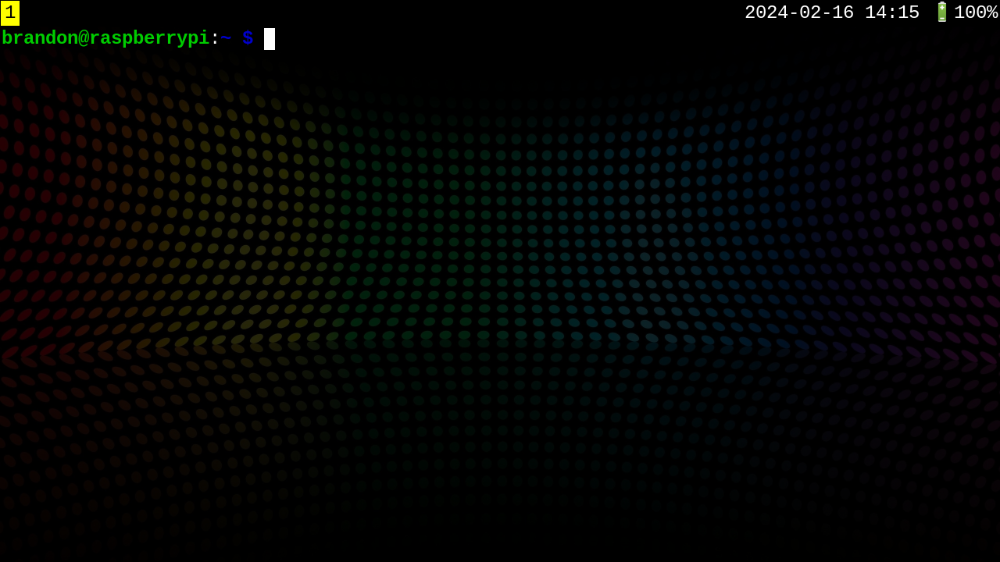

# uConsole Sway Configuration



This repository tracks configuration files specific to my
[uConsole](https://www.clockworkpi.com/uconsole).  I am sharing my
configuration in case anyone finds it useful.

I have chosen the [sway tiling compositor](https://swaywm.org/) as my
graphical environment. Its minmalist design, low footprint, and
keyboard-driven model seem ideal for the uConsole. I strongly believe
that minimizing the use of the mouse is key to making the uConsole a
functional tool.

For those wishing to remain on X11, much of this config should be
compatible with `i3`.

## About My Configuration

### Custom Scripts

| File          | Function                                   |
|---------------|--------------------------------------------|
| `bin/font.sh` | choose a linux console font interactively  |
| `battery.sh`  | outputs current battery status             |
| `gamepad.py`  | translates gamepad inputs into key presses |

### Sway Config

- Rotates output of builtin screen to correct orientation.
- Emulates a "sticky" modifier key using sway's *binding modes* (see below).
- Removes gaps, borders, and window title bars (to maximize available screen space)
  - a yellow border is drawn around the focused window if there are
    multiple on the current workspace.
- Configures `swaybar` with workspace switcher, clock, and battery status.
- Brightness control keys work
- Starts helper script to convert gamepad input to key presses.
  
#### Key Bindings

In general, they follow the sway defaults, except that you release the
the `Super` key, and *then* type the corresponding action key.

For example, to open a terminal, type `Super_R` (`Fn` + `Alt_L`)
*followed by* `Enter`. If you are already used to the default key
bindings, this should be an easy adjustment.

Gamepad inputs are converted to keyboard inputs via `gamepad.py` in
the bin directory. You can change the key bindings by editing KEYMAP
table in this script.

#### Cheat Sheet

Global Bindings (always active)

| Key             | Action                     |
|-----------------|----------------------------|
| `Fn` + `,`      | Decrease Screen Brightness |
| `Fn` + `.`      | Increase Screen Brightness |
| `Fn` + `Select` | Take Screenshot            |
| `Ctrl` + `Esc`  | Exit sway                  |

Sway Mode bindings -- prefix action with `Super_R` (`Fn` + `Alt_L`).

| Key                | Action                                    |
|--------------------|-------------------------------------------|
| `Enter`            | Launch Terminal                           |
| `d`                | Show app launcher                         |
| `D`                | Launch floating terminal                  |
| *Arrow Keys*       | Move focus in direction of arrow          |
| `Shift` + *Arrow*  | Move current window in direction of arrow |
| *Number*           | Switch to numbered workspace              |
| `Shift` + *Number* | Move current window to numbered workspac  |
| `f`                | Make current window fullcreen             |
| `q`                | Close current window                      |
| `r`                | Enter resize mode                         |
| `Esc`              | Exit to current mode                      |

### Foot Terminal Config

- Higher-contrast color scheme
- Slightly transparent background
- Hides scroll bars
- Binds mouse selection to clipboard instead of "primary" selection.
- Binds right-button to paste from clipboard, instead of "primary"
  selection.

### kbd and linux console font

Sometimes I don't bother starting sway, and I spend a fair amount of
time in the linux console.

The default linux console font is much too small to be read
directly. The `install-deps.sh` tool installs the `kbd` package, which
provides a range of fonts.

Included in the `~/bin` directory is a `font.sh` script, which can be
used to try various terminal fonts. Once you find one you like, you
can make the setting permanent with:

  sudo dpkg-reconfigure console-setup

I suggest `Uni3-Terminus24x12` as a starting point.

## TBD

- volume control keys
- make window title visible on status bar

# Installation

*TBD*: test this on a fresh image.

## Manual Installation

- install every package in `src/intall-deps.sh`
- copy all remaining files in this repo to their corresponding
  location in your home directory.

## Semi-automatic Installation

Ensure your system is up-to-date:

```
sudo apt update
sudo apt upgrade
```

Create a directory for source code, if you haven't already:

```
mkdir -p src
cd src
```

Install `dotbare`

```
git clone -t https://github.com/kazhala/dotbare
echo 'source ~/src/dotbare.plugin.bash' >> ~/.bashrc
exec bash
```

Use dotbare to pull my configuration 

```
dotbare finit -u https://github.com/emdash/uConsole_config
```

Install packages required by my configuration. Feel free to tweak the
contents of this file to suit your needs.

```
cd
src/install-deps.sh
```

Load my shell tweaks for bash (optional)

```
echo 'source ~/src/bash-setup.sh' >> ~/.bashrc
exec bash
```

## Final Steps

Choose a desktop wallpaper, and copy it to
`~/.config/sway/background`. To use my background:

```
curl https://wallpaperaccess.com/full/4154323.jpg -o ~/.config/sway/background
```

### Testing

You can test the config on an alternate virtual console: (press
`Ctrl` + `Alt` + `Fn` + `2`). Log in, and type:

```
sway
```

If you are greeted with a shiny, new, minimalist environment,
congratulations!

### Disable LDXE

If you like what you see, and are ready to ditch LXDE:

```
sudo raspi-config
```

Select `System Options` / `Boot / Auto Login` from the menu to disable
booting to LXDE.

